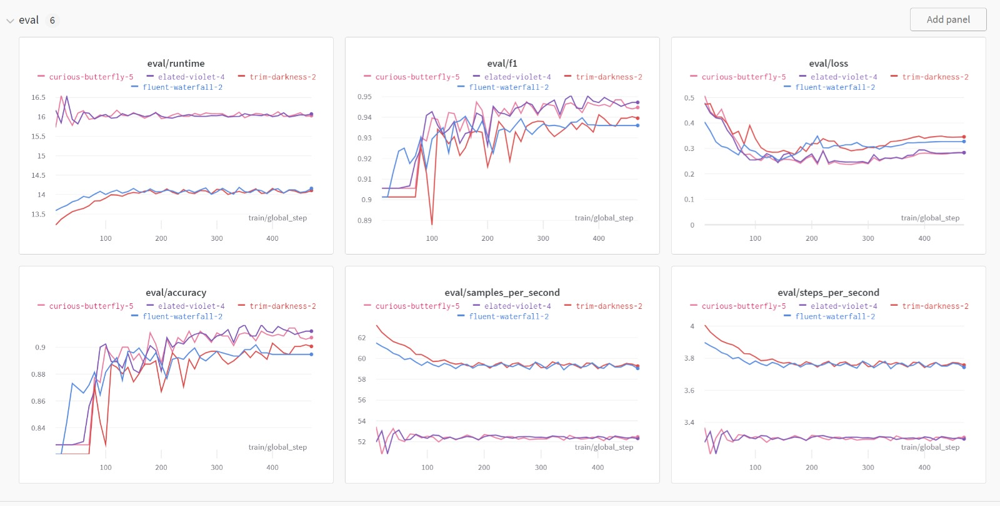

# Project Description

The goal of this project is to perform sentiment analysis on user reviews from the gaming platform Steam using the transformers library and the Hugging Face framework.
In this project, we will be using a transformer-based model to classify the sentiment of user reviews as either positive or negative. The dataset contains more than 6 million user entries and is available on Kaggle.
The idea is to download a model like BERT or DistilBERT with pre-trained weights and then fine-tune it on our own specific dataset.  We will then evaluate the performance of the model on a held-out test set and use it to classify the sentiment of unseen reviews.
Naturally, all components of the course should be implemented in the project (pipelines, deployment, monitoring, etc.), with the model supporting this.
Applications of such a model and infrastructure include predicting review scores, building more advanced recommender systems based on what users find important, and assisting developers in predicting what users value in their games.


We used the Hugging Face Transformers library, built on PyTorch, to train a model on a dataset of Steam game reviews. We first preprocessed the text data to clean and format it, and then used the pre-trained DistilBERT model from the Transformers library as the base for our model. We fine-tuned the DistilBERT model on our dataset and used it to classify the reviews as positive or negative. The PyTorch framework allowed us to easily train the model and make use of GPU acceleration for faster training times. We also utilized Hugging Face's built-in evaluation metrics and visualization tools to evaluate the performance of the model. Overall, the combination of the Hugging Face Transformers library and PyTorch made it relatively simple to train a high-performing model on our dataset.

[Launch the Demo](https://steamsentimentanalysis.streamlit.app/) 


## Coding environment

In our project, we managed dependencies using a combination of pip, a requirements.txt file and virtual environment. The requirements.txt file contains a list of all the packages and their versions that are required for the project to run correctly. To set up an exact copy of the environment, a new team member would need to have Python, pip and virtualenv installed on their machine. They would then navigate to the root directory of the project, create a virtual environment and activate it, and run the command 'pip install -r requirements.txt' to install all the dependencies listed in the requirements file. This ensures that all team members are working with the same versions of packages and helps to avoid compatibility issues. It also makes the project fully reproducible.

Using the provided Cookie cutter template we fill most of the source folders, preserving only data (cleaning up the text for sentiment analysis), models (creation, training and prediction), visualization (general model reporting, loss function etc.), tests (cloud model testing). Furthermore, the data was saved in the data folder using DVC connection with google drive, pictures and information related to model performance were saved in the reports folder, and the reference folder was filled with codes that we took inspiration from for sentiment analysis using transformers. For the docker archive, requirements and dvc have been established in the root of the repository to work with new requests and updates of new data or code.


Pylint has been implemented in the GitHub Actions pipeline to check for many possible code and formatting issues. We set a threshold of 0.8 code conformity, that means in every git push attempt the code would be tested and if the final formatting score wasnt greater than 0.8, the push would be rejected.

## Version control


In total we have implemented 4 tests for the make_dataset.py file. Those would check the size of the dataset, wether all classes were present in train, test, and valiadation and also if all the required columns were there. The other test files, corresponding to train_model.py, predict_model.py were populated with a dummy test.
These tests are automatically run when a pull request has been created, and will give feedback to the developer when they don't pass.

```
Name                          Stmts   Miss  Cover   Missing
-----------------------------------------------------------
src\_init_.py                   0      0   100%
src\data\_init_.py              0      0   100%
src\data\make_dataset.py         50     12    76%   29-34, 85-87, 91-101
tests\_init_.py                 4      0   100%
tests\test_make_dataset.py       36      0   100%
tests\test_predict_model.py       3      0   100%
tests\test_train_model.py         3      0   100%
-----------------------------------------------------------
TOTAL                            96     12    88%
```

This was the output of our coverage run. Actually, the only file we had real tests for was the make_dataset.py, and it got a result of 76%. We are not really sure why the coverage for files we didnt have real unittests for yielded a result of 100%. As our model took so long to run, it was hard to develop tests for the train_model.py file.

For the development of the project we put some rules in the repository, where at first the main branch would be protected for changes in order not to affect the code developed so far. For parallel work we set up branches where we create, the docker file, model checking, and other tasks involved to solve the problem. To maintain a clear management of the repository, we connected to Git Kraken and established an internal rule to perform several commits with comments to understand what was developed. For the merge git kraken was used as well, along with tests were created after the merge to verify that everything is in order


We use DVC to manage the data involved in the model, where we add the model, data and other files that do not involve code to the response. Also, folders have been added to the gitignore file in order not to cause conflicts in commits and merge. DVC was very useful for the development of the project, because we could update with new data, and replicate to other computers using the rules. In general, even using GCP we kept the data archive in Google drive where it would be easier to replicate the execution of the modules and progress with the project.

GitHub Actions have been setup for pylint and unittests. [pylint.yml](../.github/workflows/pylint.yml) runs pylint for all `.py` files according to the [config file](../.pylintrc). This config file specifies what things to test for (style, typing, imports, etc.), but also more specific things such as line lengths and good variable names. If the pylint score is lower than 8.0/10.0 then the check will fail and problems will have to be fixed, when it passes a pull request can be merged. [tests.yml](../.github/workflows/tests.yml) runs all tests using pytest. 

## Running code and tracking experiments

Using config files and Hydra we would have the default parameters and while running a new experiment we would overwrite the config file with new parameters so that the output model would be saved in the Hydra output folder. Additionaly, each run could be monitored in weights and biases, with a new name attributed to it.

Furthermore, we used argparser to determine batch and sample size. To run the model locally we used the following command:

python src/models/train_model.py params.sample_size=100 params.batch_size=2

We use config files. For every experiment, hydra created a new folder with the settings of that run, so it was possible to check the hyperparameters for that experiment. With this alternative it was possible to simplify the iteration and improvement process for the training and thus try to extract the maximum from the provided model. 

. As seen in the Wandb page of our experiments we performed several runs to verify the performance of the model for sentiment analysis, we could verify the time used to execute the functions to try the processing, loss of information, f1 score generated by the text and the amount of samples per second. In general, even though it was simple, we had a good overview of how our model was running and what was necessary to improve it. We believe that we could improve the quality of the management of the experiments, using clear tags for each run to understand what were the changes caused in the training and thus not need to check the config files in each run. The importance of metrics in the evaluation of the model is essential to determine the success of its release, without checking the loss, f1 score (in case of NLP) and even processing time, it is not possible to identify bottlenecks in the processing or accuracy of it, causing the release of a bad product to the public. Another challenge we had was trying to run all the experiments with the correct amount of steps and training, due to the failure to run the model in the cloud and only locally, we had many experiments that were not very "valuable" for comparison, thus creating some noise in the overall analysis


In our project, we used Docker to containerize the application and its dependencies, making it easy to run the application in different environments with the same configuration.

We created a Dockerfile, which is a script that contains instructions for building a Docker image. The Dockerfile specifies the base image, the dependencies that need to be installed, and any additional configurations needed for the application to run.

To build the Docker image, we ran the command docker build -f <Dockerfile name> . -t <image name> in the root directory of the project. This command reads the instructions in the Dockerfile and creates an image, with the image name specified by us.

To run the Docker image, we used the command docker run --name <container name> <image name>. This command creates and runs a container, using the image we built previously, and assigns it the container name specified by us.

In this way, we were able to ensure that the application and its dependencies were isolated from the host system and could be easily deployed to different environments. It also helped us to standardize the environment and the dependencies across the team, making it easy to collaborate and reproduce the results.

When running into bugs while trying to run our experiments, we mainly used simple print statements to perform debugging. This involved adding print statements to the code at key points to understand the flow of execution and identify where the bug might be occurring.

Additionally, we also used condaviz for profiling our code to identify any performance bottlenecks. Condaviz is a visualization tool that helps to identify where the performance bottlenecks are in the code, by analyzing the function call graph and the execution time of each function. This helped us to optimize the code where necessary and improve the performance of our models.

## Working in the cloud

Cloud Build: A service that lets users build and test code in the cloud.

Cloud Run: A fully managed service for running stateless containers in the cloud.

Cloud Functions: A serverless compute service that lets users run code in response to specific events.

Vertex AI: A set of tools for machine learning and artificial intelligence.

Cloud Buckets: A service for storing and retrieving data in the cloud.

Container Registry: A service for storing and managing container images in the cloud.

We used a variety of different types of VMs depending on the specific requirements of our experiments. For example, we used standard VMs with a moderate amount of memory and CPU for running simple experiments and small-scale training jobs. For more demanding workloads, we used high-memory and high-CPU VMs, with large amounts of memory and CPU to handle large datasets and perform complex computations.


GCP bucket can be seen in [figure](reports/figures/hugging_bucket.jpeg) and [figure](reports/figures/hugging_bucket2.jpeg).

GCP container registry can be seen in [this figure](reports/figures/hugging_registry.jpeg).

Cloud build history can be seen in [this figure](reports/figures/hugging_build.jpeg) (this is only from one account, some other builds were made on other GCloud accounts).


We wrapped out model into a simple Streamlit interface.

Unfortunately we have not applied model monitoring, this step would be essential to set up alert systems to warn us about potential risks to the model, which we would like to monitor the credits in the GCP, or the runtime for model retraining. While being objective, this function would help a lot in the overall product maintenance and could provide insights on optimization being cost or processing.

In total we spent around 8 dollars. Mostly for attempting to host inference with our predict script. A test version was sent in a groupchat with my friends, and they all tested the app several times. Some other credits were spent on prototyping and experimetation, in order to see what components worked best.

## Overall discussion of project

 The beginning of our pipeline is at the setup site, where we perform the tasks of cleaning, choosing the model, and uploading the data to Google drive via DVC. It is important to remember that we follow the cookie cutter format to build a database following the steps for sentiment analysis in game reviews on steam. After that, we create a repository having branches related to tests, main code and additionally features to the model, creating commits with relevant comments for the updates and if necessary the mrge for the main branch. For each commit and pull, tests were run using github actions and pylint trying to ensure the quality of the uploaded code. For each update to the repository we created a docker image to train the model where users could pull the latest image and at the same time test the front end interface we created with streamlit. We also tried to assemble all the steps developed so far locally in the cloud system, trying to save the data, train the model with all the data and deploy it by creating alert and performance monitoring rules, however due to image creation problems it was not possible, so we continued with the local operation rules. Overall the model became positive, with several experiments being run on W&B and standardization of hyperparameters using Hydra for testing the model change and performance.

Our ML Ops architecture includes the following components:

Data preparation: This includes data acquisition, cleaning, and preprocessing, which is the process of getting data ready for training and validation.

Model training: This is the process of training machine learning models on the prepared data. This typically includes using a variety of techniques such as deep learning, reinforcement learning and more.

Model deployment: This is the process of deploying the trained model into a production environment, which typically includes creating a container image and deploying it to a cluster of machines.

Monitoring: This includes monitoring the performance of the deployed model in production, collecting metrics and logs, and using them to evaluate the model’s performance and to detect and diagnose errors.

Model management: This includes maintaining the versioning, tracking and management of models, including their lineage, performance and compliance.

Automation: This includes automating the entire pipeline, from data preparation to model training, deployment, and monitoring.


Our main struggles in the project actually stemmed from model deployment and continuous integration.

Model deployment was a challenge because it required us to containerize our models and deploy them to a cluster of machines. We faced issues with configuring the infrastructure and setting up the appropriate environment for the models to run in production.

Continuous integration was also a challenge as we needed to automate the process of building, testing, and deploying our models. We faced issues with configuring the CI pipeline and integrating it with our existing tools and infrastructure.

To overcome these challenges, we adopted a number of strategies. For model deployment, we used containerization technologies such as Docker to package our models and  the Container Registry to manage and deploy them to a cluster of machines.

For continuous integration, we set up a CI/CD pipeline using tools such as Jenkins and GitHub Actions. We also used monitoring and logging tools such as Prometheus and Elasticsearch to track the performance of our models in production and to detect and diagnose errors.

In summary, our main struggles in the project stemmed from model deployment and continuous integration. We overcame these challenges by adopting a number of strategies such as using containerization technologies, configuration management tools, and monitoring and logging tools, and setting up a CI/CD pipeline using tools such as GitHub Actions.

